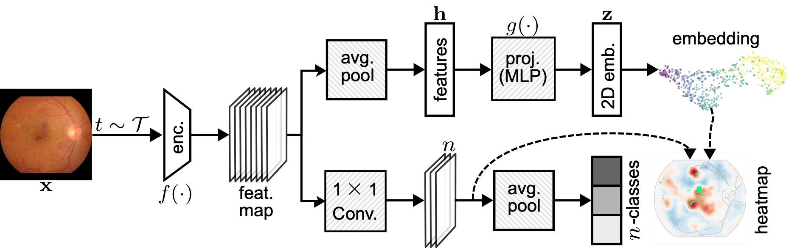

# Dual-IFM: Interpretable Foundation Model for Retinal Fundus Images

This repository contains the code for the paper ["Towards Interpretable Foundation Models for Retinal Fundus Images"](https://arxiv.org/pdf/2603.18846). We introduce Dual-IFM, an interpretable foundation model for retinal fundus images that combines local explanations with a direct visualization of the representation space.



## Pretraining

The t-SimCNE implementation is adapted from [t-SimCNE](https://github.com/berenslab/t-simcne), extending it to **multi-GPU distributed training in bfloat16 precision** (float16 overflows when computing t-SimCNE distances on large datasets).

---

## Environment setup

This project uses [`uv`](https://github.com/astral-sh/uv) for fast Python environment and dependency management, but the dependencies can be installed into any environment with `pip`.

### Option 1 — Using uv (recommended)
```bash
uv sync
source .venv/bin/activate
uv pip install -e .
```

### Option 2 — Using pip
```bash
pip install -e .
```

---

## Model weights

Pretrained model weights are available in the [model_weights](./model_weights) directory.

Checkpoint filenames follow the format:

    <ssl_method>_<backbone>_<dataset>_<image_size>_<epochs>.pt

- `ssl_method` – SSL pretraining strategy (simclr, tsimcne, tsimcne2d).
- `backbone` – architecture (bagnet33, resnet50).
- `dataset` – dataset used for pretraining (`all` refers to a mixed EyePACS + AREDS + UKB dataset).
- `image_size` – square image resolution (e.g. 256 → 256×256).
- `epochs` – number of pretraining epochs.

The Dual-IFM checkpoint is [tsimcne2d_bagnet33_all_256_1225.pt](./model_weights/tsimcne2d_bagnet33_all_256_1225.pt): trained with t-SimCNE using SimCLR cosine-similarity loss for stage one before switching to the standard t-SimCNE Euclidean/Cauchy-similarity loss for the last two stages.

---

## Datasets

The following retinal fundus datasets are supported out-of-the-box. Datasets are not provided — users must obtain access and download them independently.

| Dataset | Task |
|---|---|
| APTOS | Diabetic retinopathy grading |
| AREDS | AMD grading |
| DeepDRiD | Diabetic retinopathy grading |
| EyePACS | Diabetic retinopathy grading |
| FIVES | Vessel segmentation / classification |
| Glaucoma | Glaucoma detection |
| iDRiD | Diabetic retinopathy / lesion detection |
| Messidor | Diabetic retinopathy grading |
| PAPILA | Glaucoma detection |
| UKB | Retinal imaging |

The code expects datasets to be organized as:

```
datasets/
└── <dataset_name>/
    ├── dim_<resolution>/   # images (e.g. dim_256/)
    └── metadata/
        └── metadata.csv
```

To use a custom dataset, modify the dataset classes in `src/dual_ifm/utils/datasets.py` to match your directory structure.

---

## Project structure

```
configs/           Hydra config files (pretraining, classification, datasets)
scripts/           SLURM shell scripts for running experiments
src/dual_ifm/      Python package
  ├── tsimcne/       t-SimCNE pretraining (multi-GPU)
  ├── simclr/        SimCLR baseline pretraining
  ├── classification/ Downstream task training (finetune, linear probe, projector)
  ├── interpretation/ Local interpretability (class evidence maps)
  └── utils/         Shared utilities (datasets, optimizers, plotting)
notebooks/         Analysis and usage notebooks
model_weights/     Pretrained model checkpoints
```

---

## Running experiments

Scripts for SLURM are in `scripts/`. Config files for all experiments are in `configs/`.

### Pretraining

```bash
bash scripts/pretrain/tsimcne2d.sh   # Dual-IFM (t-SimCNE 2D, cosine loss for stage 1)
bash scripts/pretrain/tsimcne.sh     # t-SimCNE
bash scripts/pretrain/simclr.sh      # SimCLR 
```

### Downstream tasks (classification)

```bash
bash scripts/classification/linear_probe.sh     # Linear evaluation
bash scripts/classification/finetune.sh         # Finetuning
bash scripts/classification/align_projector.sh  # 2D projector alignment for visualization
```

### Experiment tracking & checkpoints

- Training metrics (loss, AUROC) are tracked with W&B. For t-SimCNE, gradient norm, max and distances can also be tracked.
- Model checkpoints are saved locally, including weights, optimizer and scheduler state and training metrics as PyTorch objects.
- Experiment outputs (Hydra runs, W&B files) are saved locally by default: W&B is run in **offline mode** but this can be changed in the config files. To sync experiments run `wandb sync`.
- Examples of config files and running commands can be found in the `configs/` and `scripts/` directories, including a setup for hyperparameter sweeps.

---

## Notebooks

| Notebook | Purpose |
|---|---|
| [`usage.ipynb`](./notebooks/usage.ipynb) | Load pretrained model, run inference on a sample input |
| [`preprocess_datasets.ipynb`](./notebooks/preprocess_datasets.ipynb) | Preprocess dataset metadata to match the expected format |
| [`eval_global.ipynb`](./notebooks/eval_global.ipynb) | Global structure inspection — 2D projection visualization |
| [`eval_local.ipynb`](./notebooks/eval_local.ipynb) | Local interpretability — class evidence maps |
| [`eval_clf_linear.ipynb`](./notebooks/eval_clf_linear.ipynb) | Linear probe evaluation results |
| [`eval_clf_finetune.ipynb`](./notebooks/eval_clf_finetune.ipynb) | Finetuning evaluation results |
| [`eval_tsimcne.ipynb`](./notebooks/eval_tsimcne.ipynb) | SSL pretraining evaluation |

---

## Citation

If you use this work, please cite:

```bibtex
@misc{mensah2026dualifm,
  title={Towards Interpretable Foundation Models for Retinal Fundus Images},
  author={Mensah, Samuel Ofosu and Roa, Camila and Djoumessi, Kerol and Berens, Philipp},
  year={2026},
  eprint={2603.18846},
  archivePrefix={arXiv},
  primaryClass={cs.CV},
  doi={10.48550/arXiv.2603.18846}
}
```

